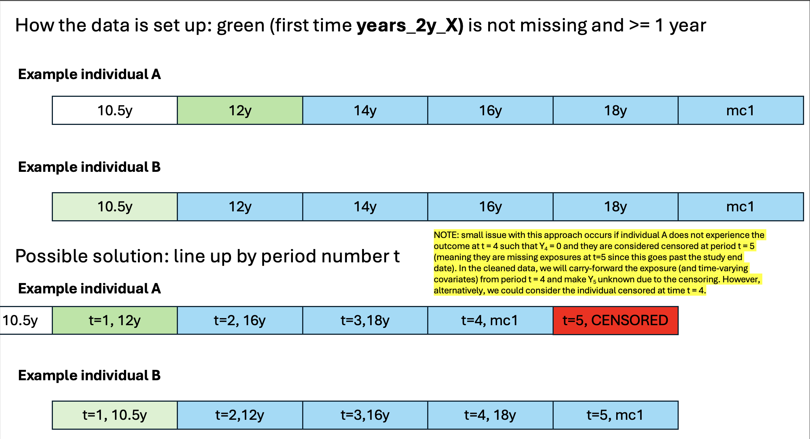
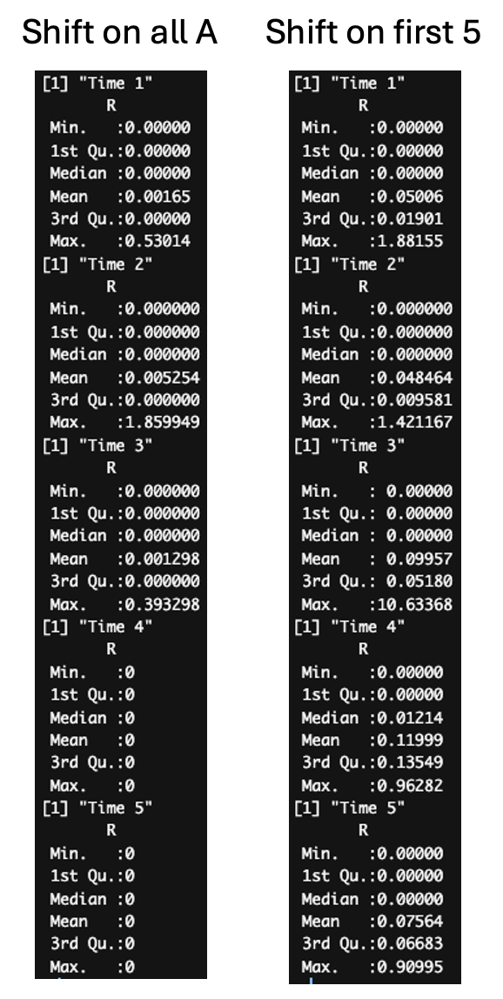
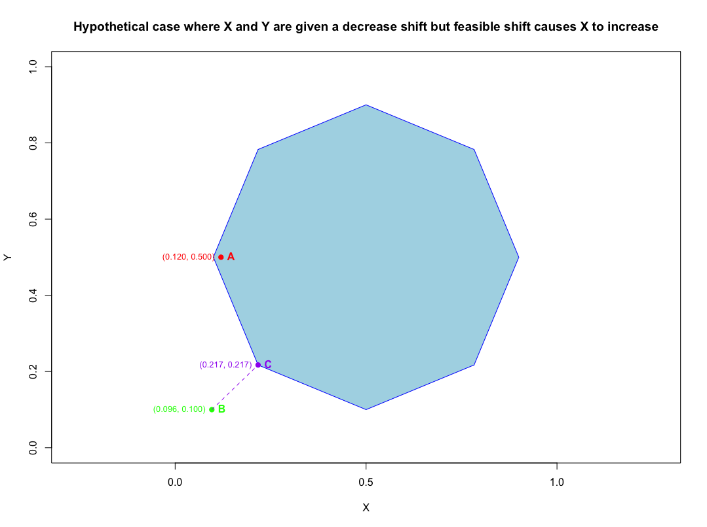

Exposures (7 classes):
- Organophophates
- Pyrethroids
- Carbamates
- Neonicotinoids
- Manganese fungicides 
- Glyphosate herbicides
- Paraquat herbicides

Outcome:
- Maternal hypertension

- File `00_data_cleaning.R` contains basic data cleaning on the original data (n = 621), such as:
  - Completely ignoring the `14 year` visit due to differences in outcome measurement at this time point
    - NOTE: This means any exposures, time-varying covariates, and outcomes are ignored in both the analysis and when doing LOCF (or should they be included when doing LOCF imputation?)
  - Removing individuals with cancer at baseline (n = 11 removed)
    - NOTE: 2 individuals are missing baseline cancer/high blood pressure status but they are kept in the data for now
  - Identifying the first period of observation (we define this as the first period during which years_PERIOD >= 1 year), individuals with no sufficient first period of observation removed (n = 109 removed)
    - NOTE: See image below for further details
    - NOTE: the 1 year cutoff was chosen in discussion with Lucia
  - For any subsequent time points, if an individual has missing years_PERIOD or years_PERIOD < 1 year, their exposures will be set to `NA` for that period and the exposure values from the previous time period will be carried forward. This is done because we assume that not enough exposure data has been observed at that time point
    - NOTE: Alternatively, we could consider censoring individuals when the number of years observed is insufficient 
  - Creating censoring variables where censoring occurs when outcome is missing; converting censoring into a survival-type censoring, meaning that once an individual experiences censoring, they will have experienced it for all remaining time points
  - Converting maternal hypertension outcome to a survival-type outcome, meaning that once an individual experiences the outcome, they will have experienced it for all remaining time points
  - Removing individuals who experienced outcome or were reported to have high blood pressure prior to time period 1 (n = 94 removed)
  - Adding missing indicators for missing values in baseline variables, impute baseline missing values with mode/median, any subsequent missing values imputed using LOCF (except for age which we impute using an approximation; for example, if an individual is missing `age_10_5y` but not `age_9y`, we can impute the approximation `age_9y` + 1.5 years)
  - Converting any variables occurring after outcome has occurred or censoring has occurred to `NA`
  - Truncating all exposure variables at their respective 95th percentile values due to presence of outliers

How many people are censored because they are actually missing the outcome or because "joined late"?
  - Looks like more people are censored because they are missing the outcome so we will use LOCF for missing exposures and time-varying covariates for those that "joined late"

|          | Missing outcome | Joined Late|
|----------|----------|----------|
| Time 1    | 15         | --    |
| Time 2    | 28     | 0    |
| Time 3    | 37     | 7    |
| Time 4    | 10     | 10    |
| Time 5    | 0     | 9    |
  
n = 407 individuals remaining

- File `1_convex_hull.R` contains code to scale the treatment variables and apply the convex hull at each time period independently
  - We apply a 20% reduction shift on all pesticide classes
  - For those that fall outside of the convex hull, we keep their exposures at the observed values
    - Convex hull is just an approximation and not perfect which can lead to small issues that are not supposed to happen (e.g. exposures being increased, shifts that don't make sense)
      - For example, even if no shift is applied to a point, the returned point might be slightly different than the original point due to numeric approximations
      - Therefore, allow for an up to 5% tolerance such that if all variables of the feasible shifted point falls within 5% of the expected shifted point, we still allow the expected intervention/shift to occur
  - R statistic (distance) summary: 
    - Little concern of extrapolation
  
- Files `2a_analysis_multiplicative_all_exposures.R` and `2b_analysis_multiplicative_first_5_exposures.R` contain code to conduct longitudinal analyses on the shifted data
  
Other Notes:

- Can the feasible convex hull shift actually cause exposures to increase when a decrease shift is applied?
  - Potentially: see example below where we have an observed point red A with coordinates (x,y) and decrease x by 20% and y by 80% (resulting in green point B) which falls outside of the convex hull. The closest point to point B that lies in the hull is point C. However, this results in x increasing by 44.7% (purple point C) from the observed value of x.
  

