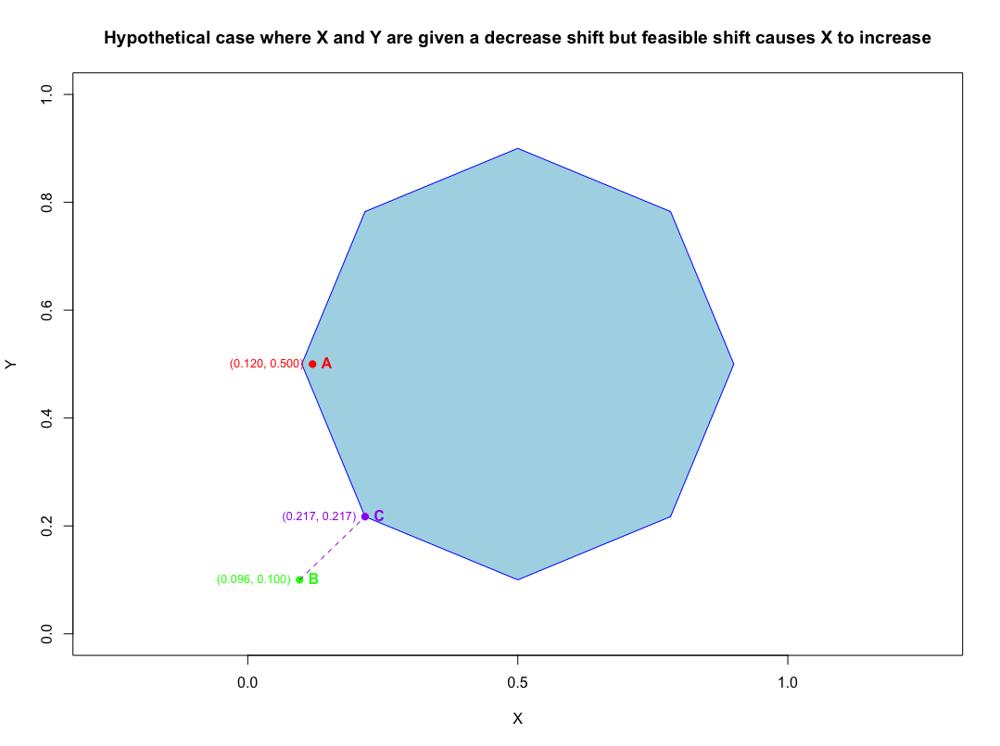

- File `1a_convex_hull_all.R` contains code to scale the treatment variables and apply the convex hull at each time period independently
  - We apply a 20% reduction shift on all pesticide classes
  - For those that fall outside of the convex hull, we keep their exposures at the observed values
    - Convex hull is just an approximation and not perfect which can lead to small issues that are not supposed to happen (e.g. exposures being increased, shifts that don't make sense)
      - For example, even if no shift is applied to a point, the returned point might be slightly different than the original point due to numeric approximations
      - Therefore, allow for an up to 0.006 tolerance such that if ALL variables of the feasible shifted point falls within 0.006 of the expected shifted point, we still allow the expected intervention/shift to occur (NOTE: this may depend on your data)

- Files `1ab_R_statistic.R` and `1ac_plotting_convex_hulls_2D_3D.R` contain exploratory code looking at extrapolation and support

- Files `2_analysis_longitudinal.R` and `3a_analysis_single_timepoint.R` contain code to conduct longitudinal and single time point lmtp analyses, respectively, on the shifted data
  
Other Notes:

- Can the feasible convex hull shift actually cause exposures to increase when a decrease shift is applied?
  - Potentially: see example below where we have an observed point red A with coordinates (x,y) and decrease x by 20% and y by 80% (resulting in green point B) which falls outside of the convex hull. The closest point to point B that lies in the hull is point C. However, this results in x increasing by 44.7% (purple point C) from the observed value of x.
  

